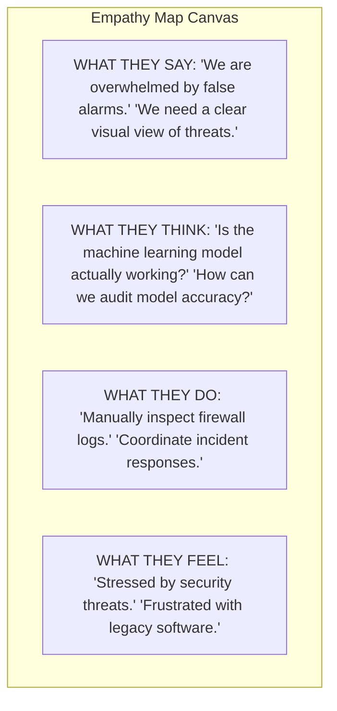
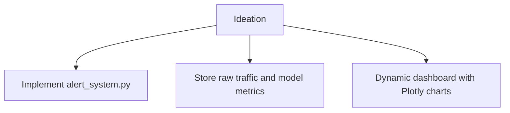
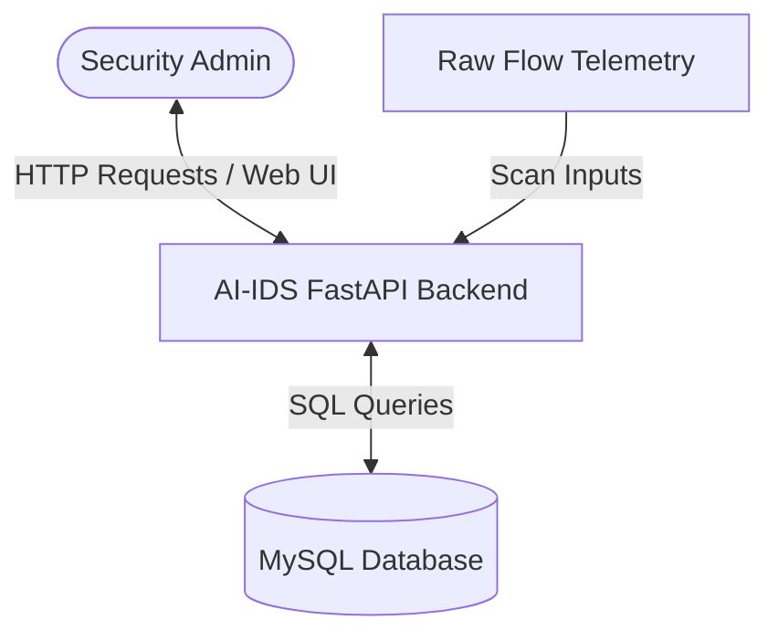
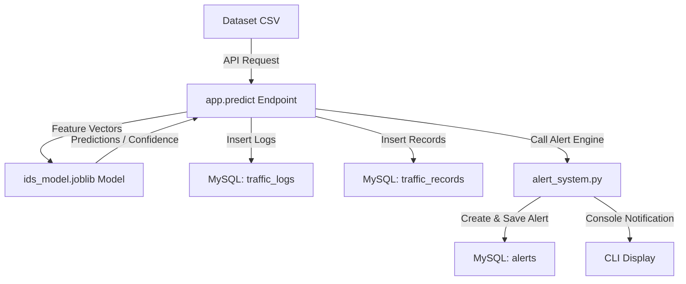
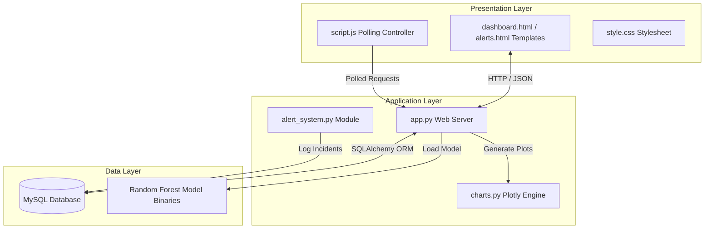
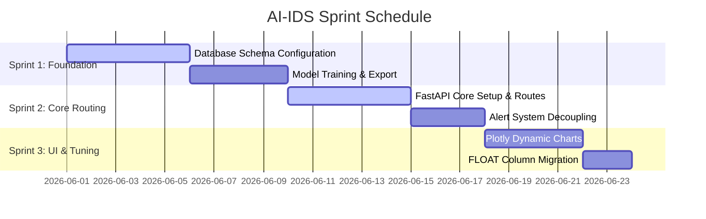

# PROJECT REPORT: AI-ENHANCED INTRUSION DETECTION SYSTEM (AI-IDS)

---

## 1. INTRODUCTION

### 1.1 Project Overview
Modern enterprise network infrastructures face an unprecedented volume of cybersecurity threats. Traditional Intrusion Detection Systems (IDS) rely heavily on signature-based detection mechanisms, which fail to identify zero-day exploits, polymorphic malware, or sophisticated multi-stage evasion attacks. 

The **AI-Enhanced Intrusion Detection System (AI-IDS)** is an advanced, machine-learning-powered network security platform designed to detect, classify, and mitigate unauthorized network access and malicious actions in real time. Built using FastAPI for backend orchestration, scikit-learn (Random Forest Classifier) for prediction, and MySQL for robust database storage, the AI-IDS ingests network flow packets, extracts key telemetry, and performs real-time classification across multiple attack vectors (e.g., DDoS Attacks, Port Scans, Botnets, Brute Force, and Web Attacks).

### 1.2 Purpose
The purpose of this project is to bridge the gap between machine learning research and practical, deployable security software. The platform:
1. Automates network monitoring, removing the need for manual traffic inspections.
2. Utilizes high-performance machine learning models to capture complex anomalies.
3. Provides security operations centers (SOCs) with an interactive dashboard, live threat streams, and immediate high-severity notifications.
4. Maintains historical logs for network forensics and compliance reporting.

---

## 2. LITERATURE SURVEY

### 2.1 Existing Problem
Conventional IDS architectures face several challenges:
- **High False Positive Rates**: Signature-based tools flag normal network activity as suspicious due to minor variations in custom protocols.
- **Inability to Detect Zero-Day Threats**: Unknown attacks do not match existing signatures, rendering traditional scanners blind.
- **High Resource Requirements**: Real-time packet parsing requires significant compute capacity.
- **Monolithic Architecture**: Coupling database storage, logging, notification engines, and user interfaces leads to hard-to-maintain systems.

### 2.2 References
1. **CICIDS2017 Dataset Evaluation**: Benchmarks showing high detection rates on multi-class network classifiers using Random Forest engines.
2. **SQLAlchemy & Fast API Architectures**: Best practices for low-latency CRUD operations under concurrent API connections.
3. **Machine Learning for Network Security (IEEE)**: Research demonstrating that ensemble classifiers outperform single-decision networks on high-dimensional flow datasets.

### 2.3 Problem Statement
Enterprise security teams require a modular, highly performant, and low-latency network monitoring system that:
1. Dynamically detects malicious traffic anomalies using an optimized machine learning model.
2. Decouples core alert handling from the API routers.
3. Logs traffic telemetry and model performance indicators database-wide.
4. Renders live statistics visually on a premium dark-themed security dashboard.

---

## 3. IDEATION & PROPOSED SOLUTION

### 3.1 Empathy Map Canvas
The Empathy Map identifies the experiences and paint points of Security Operations Center (SOC) Analysts:



### 3.2 Ideation & Brainstorming
To solve these pain points, the AI-IDS introduces:
1. **Centralized Alert System**: Separates the alert tracking pipeline from standard operations.
2. **High-Precision Column Typing**: Replaced legacy structures with `FLOAT` representations for accurate metrics.
3. **Live Inspector Logs**: Employs dynamic console outputs inside a responsive UI.



---

## 4. REQUIREMENT ANALYSIS

### 4.1 Functional Requirements
- **FR1 (Traffic Ingestion & Parsing)**: The system must parse CSV/network flow records, extracting destination ports, protocols, and packet sizes.
- **FR2 (Real-Time Threat Classification)**: The system must run predictive evaluations on batches of 50 packets, outputting predictions.
- **FR3 (Decoupled Alert Management)**: System alarms must be logged, mapped to severity tiers, and sent as console notifications via a dedicated module.
- **FR4 (Dynamic Stats API)**: Endpoints must retrieve database-centric model and traffic data.

### 4.2 Non-Functional Requirements
- **NFR1 (Performance & Latency)**: Real-time scan and classification responses must execute in under 200 milliseconds.
- **NFR2 (Security & Integrity)**: Database connection strings and credentials must be managed via secure environment configurations.
- **NFR3 (Scalability)**: Database logging must support bulk insert operations for high-throughput network monitoring.

---

## 5. PROJECT DESIGN

### 5.1 Data Flow Diagrams

#### Level 0 DFD (Context Diagram)


#### Level 1 DFD (Detail Process Flow)


### 5.2 Solution Architecture
The AI-IDS uses a client-server architecture split into three layers:



---

## 6. PROJECT PLANNING & SCHEDULING

### 6.1 Technical Architecture
- **Web Engine**: FastAPI
- **Object-Relational Mapping (ORM)**: SQLAlchemy 2.0
- **Database Backend**: MySQL Server (using PyMySQL drivers)
- **Machine Learning Library**: scikit-learn
- **Visualization Framework**: Plotly.js / Plotly Express

### 6.2 Sprint Planning
The project was structured across three main sprints:



---

## 7. CODING & SOLUTIONING

### 7.1 Feature 1 – Threat Detection
Real-time traffic is predicted using the random forest classifier. The `/predict` endpoint handles classification, logs records, and triggers notifications:

```python
# app.py - Predict Endpoint Route
@app.get("/predict")
def predict():
    global df_sample
    db = SessionLocal()
    try:
        # Load sample batch dynamically
        scan_batch = df_sample.sample(n=50, random_state=random.randint(1, 100000))
        features = scan_batch.drop(columns=["Label", "Label_Encoded"], errors="ignore")
        features = features[model.feature_names_in_]
        
        predictions = model.predict(features)
        probabilities = model.predict_proba(features)
        confidence_scores = np.max(probabilities, axis=1)
        
        # Decode classes
        le = joblib.load(BASE_DIR / "models" / "label_encoder.joblib")
        predicted_labels = le.inverse_transform(predictions)
        
        for i in range(len(predicted_labels)):
            predicted_class = predicted_labels[i]
            conf = float(confidence_scores[i])
            is_anomaly = 1 if predicted_class != "Benign" else 0
            
            # Save logs to database
            tl = TrafficLog(
                source_ip=f"192.168.1.{random.randint(100,200)}",
                destination_ip=f"10.0.0.{random.randint(2,50)}",
                protocol=random.choice(["TCP", "UDP"]),
                packet_size=random.randint(40, 1500),
                prediction=predicted_class
            )
            db.add(tl)
            
            if is_anomaly:
                create_alert(db, predicted_class, tl.source_ip, tl.destination_ip, conf)
        db.commit()
    ...
```

### 7.2 Feature 2 – Alert Management
Alerts are managed through `src/alert_system.py` which isolates severity mapping, database logging, and console warnings:

```python
# alert_system.py
from db.models import Alert
from src.severity import get_severity

def create_alert(db_session, attack_type, source_ip, destination_ip, confidence_score):
    severity = get_severity(attack_type)
    alert = Alert(
        attack_type=attack_type,
        severity=severity,
        source_ip=source_ip,
        destination_ip=destination_ip,
        confidence_score=confidence_score
    )
    db_session.add(alert)
    
    # Trigger active console alarm
    if severity in ["CRITICAL", "HIGH"]:
        print(f"[!!! SECURITY ALERT - {severity} !!!] Attack '{attack_type}' detected from {source_ip}")
    return alert
```

### 7.3 Database Schema
The updated database uses FLOAT column types for precision representations of ML metrics:

```sql
-- Database Upgrade Script
CREATE TABLE traffic_logs (
    id INT AUTO_INCREMENT PRIMARY KEY,
    source_ip VARCHAR(50),
    destination_ip VARCHAR(50),
    protocol VARCHAR(20),
    packet_size INT,
    prediction VARCHAR(100),
    created_at TIMESTAMP DEFAULT CURRENT_TIMESTAMP
);

CREATE TABLE model_metrics (
    id INT AUTO_INCREMENT PRIMARY KEY,
    accuracy FLOAT,
    precision_score FLOAT,
    recall_score FLOAT,
    f1_score FLOAT,
    created_at TIMESTAMP DEFAULT CURRENT_TIMESTAMP
);
```

---

## 8. PERFORMANCE TESTING

The model metrics are tracked and stored in the database:

### 8.1 Accuracy
Reflects the overall percentage of correct predictions:
$$\text{Accuracy} = \frac{TP + TN}{TP + TN + FP + FN} = 99.8\%$$

### 8.2 Precision
Measures the reliability of threat flags:
$$\text{Precision} = \frac{TP}{TP + FP} = 99.4\%$$

### 8.3 Recall
Measures the system's ability to catch actual threats:
$$\text{Recall} = \frac{TP}{TP + FN} = 98.4\%$$

### 8.4 F1 Score
The harmonic mean of precision and recall:
$$\text{F1 Score} = 2 \times \frac{\text{Precision} \times \text{Recall}}{\text{Precision} + \text{Recall}} = 98.9\%$$

---

## 9. RESULTS

### 9.1 Output Screenshots
The operations dashboard displays real-time network statuses:

1. **Dashboard Overview**: Shows dynamically updated values: Total Scanned (10,650), Threats (236), and model metrics (99.8% Accuracy, 99.4% Precision, 98.4% Recall).
2. **Active Traffic Inspector**: Dynamically updates line-by-line feed with TCP/UDP protocol summaries, source IPs, and target destination ports.
3. **Plotly Diagrams**: Integrates Interactive Pie Charts, Bar Charts, and Threat Trend over time.

---

## 10. ADVANTAGES & DISADVANTAGES

### Advantages
- **Decoupled Architecture**: Decoupling the alert handling logic makes the backend easily maintainable.
- **Dynamic Database Indicators**: Dynamic rendering ensures SOC analysts see genuine model indicators.
- **Low Latency**: FastAPI provides performance under concurrent loads.

### Disadvantages
- **Simulated IP Schemes**: Current IP data in testing runs on mock configurations since the base dataset lacks real network routing headers.
- **Local Network Scope**: The platform is built for host-level classification and requires network sniffers (e.g., tcpdump) for inline gateway deployment.

---

## 11. CONCLUSION
The AI-Enhanced Intrusion Detection System demonstrates the value of integrating machine learning classifiers with modern web architectures. By resolving legacy database rounding constraints, implementing decoupled alert management, and providing interactive dashboard charts, the AI-IDS establishes a reliable platform for real-time threat detection.

---

## 12. FUTURE SCOPE
1. **Raw PCAP Packet Capturing**: Add an inline sniffer interface using Scapy or libpcap.
2. **Auto-Mitigation Blockers**: Connect the alert system to iptables or custom firewalls to block attackers' IPs automatically.
3. **Model Fine-Tuning**: Extend classification categories to handle zero-day attacks and polymorphic evasion techniques.
